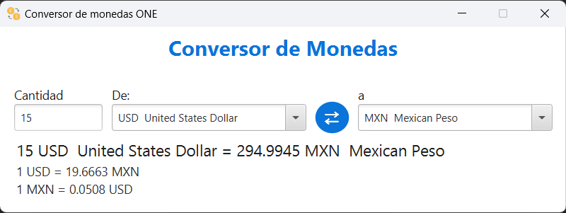

# Conversor de Monedas

Este proyecto es un desafío de conversión de monedas propuesto por ONE (Oracle Next Education). La aplicación permite a los usuarios convertir fácilmente entre diferentes divisas utilizando tasas de cambio en tiempo real proporcionadas por la API de ExchangeRate-API. Con una interfaz gráfica intuitiva, los usuarios pueden ingresar una cantidad, seleccionar la moneda base y la moneda objetivo, y ver instantáneamente el resultado de la conversión.




## Tecnologías Utilizadas

- **Java**: Lenguaje de programación principal.
- **JavaFX**: Para crear la interfaz gráfica de usuario (GUI).
- **Gson**: Biblioteca utilizada para convertir los datos obtenidos de la API en objetos Java.
- **CSS**: Para estilizar la interfaz de usuario.
- **Patrón MVC**: Se ha implementado el patrón Modelo-Vista-Controlador para estructurar el código de manera organizada y mantenible.

## Funcionalidades

- Obtener y mostrar tasas de cambio en tiempo real.
- Convertir una cantidad de dinero de una moneda a otra.
- Interfaz gráfica para interactuar con el usuario.

## Requisitos

Asegúrate de tener instalado lo siguiente:

- **JDK 17 o superior**: Puedes descargarlo desde [aquí](https://www.oracle.com/java/technologies/downloads/).
- **JavaFX**: Necesitarás agregar las bibliotecas de JavaFX a tu proyecto. Puedes obtenerlas desde [Gluon](https://gluonhq.com/products/javafx/).


## Cómo Usar el Proyecto en IntelliJ

1. Clona el repositorio:
   ```bash
    https://github.com/AlfonsoVidrio/conversor-de-monedas.git
   ```
2. **Abre IntelliJ IDEA** y selecciona "Abrir proyecto".

3. **Selecciona el directorio del proyecto** que acabas de clonar y haz clic en "OK".

4. **Configura el archivo `.env`**:
   - Renombra el archivo `.env-template` a `.env`.
   - Abre el archivo `.env` y cambia el valor de la variable `API_KEY` con tu propia clave de API:
     ```
     API_KEY=your_api_key
     ```
   - Asegúrate de reemplazar `your_api_key` con la clave que obtuviste al registrarte en ExchangeRate-API.

5. **Configura JavaFX**:
   - Ve a **Run > Edit Configurations**.
   - Selecciona la configuración de tu clase principal (RunApp).
   - Haz clic en "Modify options" y selecciona "Add VM options".
   - Agrega las siguientes opciones (ajusta la ruta según donde tengas JavaFX):
     ```
     --module-path "C:\path\javafx-sdk-23\lib" --add-modules javafx.controls,javafx.fxml
     ```

6. **Ejecuta la aplicación**:
   - Haz clic derecho en la clase principal que contiene el método `main` y selecciona "Run".

7. **Utiliza la interfaz gráfica** para seleccionar las monedas y realizar conversiones.

  - Ingresa la cantidad que deseas convertir en el campo de texto.
  - Selecciona la moneda base utilizando el primer checkbox.
  - Selecciona la moneda objetivo utilizando el segundo checkbox.
  - Si deseas intercambiar las monedas, haz clic en el botón de intercambio.
  - La conversión se actualizará automáticamente.

## Autor

Desarrollado por **Alfonso Manuel Vidrio Lizaola**.

- **LinkedIn**: [Alfonso Manuel Vidrio Lizaola](https://www.linkedin.com/in/alfonsomanuelvidriolizaola/)
